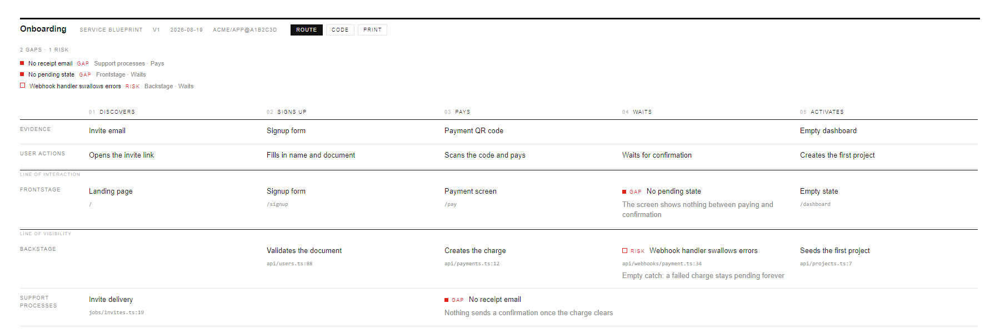
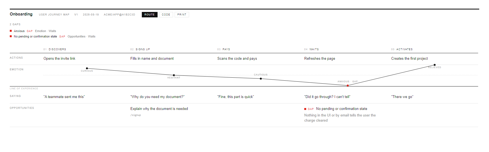

# journey

Turn a codebase into a Service Blueprint or a User Journey Map you can actually
look at — a single self-contained HTML file that opens by double-click,
offline, with every implementation claim backed by a verified `file:line` and
every hole marked as a gap instead of smoothed over.

**[See it working →](https://craice.github.io/journey/)** — two live artifacts, no install.

### Service Blueprint



Five phases across, five lanes down. The red cells are the point: a screen that
was never built, a confirmation nothing sends, a handler that swallows its
errors. Each of the others carries the route or the `file:line` it came from.

### User Journey Map



The same flow seen from the outside — what the person does, how it feels, what
they say, and where the opportunity sits. The sparkline's low point is flagged,
because the dip and the gap are the same fact told twice.

## Use it with a coding agent

Point a coding agent at this repository and ask for an artifact:

> create a service blueprint of \<flow\> using github.com/craice/journey

The agent fetches [`SKILL.md`](SKILL.md) and follows it:

```bash
curl -sL --fail https://raw.githubusercontent.com/craice/journey/main/SKILL.md -o /tmp/journey-skill.md
```

It reads the code, fills each lane from what it actually finds, backs every
claim with a real route or `file:line`, and marks anything it can't verify as
a gap rather than guessing.

## Use it by hand

1. Download [`template.html`](template.html).
2. Replace the JSON inside `<script type="application/json" id="artifact">`
   with your own data, following the field reference in
   [`SCHEMA.md`](SCHEMA.md).
3. Open the file in a browser. That's it — no build, no server.

Two worked examples are committed under [`examples/`](examples/):
[`blueprint-onboarding.html`](examples/blueprint-onboarding.html) (a Service
Blueprint) and [`journey-onboarding.html`](examples/journey-onboarding.html)
(a User Journey Map). Download either one and open it to see the format
before writing your own — the blueprint shows Evidence, User actions,
Frontstage, Backstage and Support processes lanes across a five-step
onboarding flow; the journey shows the same flow through Actions, an emotion
curve, Saying and Opportunities lanes.

## What you get

- Lane labels and column headers that stay pinned while you scroll a wide
  artifact.
- A Route / Code switch: the artifact shows each screen's route by default and
  swaps to the `file:line` behind it on demand, so the whole picture reads as a
  path through the product rather than a tour of the source tree.
- Columns held to a readable measure, so a few phases on a wide monitor stay a
  grid rather than stretching into empty fields.
- Print to PDF in landscape, with the interface and the sticky positioning
  dropped. A grid wider than the page is not scaled down to fit it.
- A gap summary band listing every flagged cell, each one click-to-scroll to
  its place in the grid.
- Every claim about what the product does carries its address on the cell —
  a route, a `file:line`, or both.
- Readable validation errors — a malformed artifact reports what's wrong
  instead of rendering a blank page.
- Every flag is marked by colour and by a text label ("Gap" / "Risk"), never
  colour alone.

## Design notes

Swiss pure-grid layout, one accent colour, system fonts only. No
dependencies, no build step, no network access at runtime — the file that
opens is the whole program. It prints the same grid it shows on screen, in
landscape, without redesigning itself for paper — a grid wider than the sheet
is clipped rather than shrunk.

## Development

```bash
node --test tests/          # 74 tests, no npm dependencies of any kind
node tools/build-examples.js  # regenerates examples/*.html from examples/src/*.json
```

The logic in `template.html`'s `<script id="core">` block stays free of
`document` and `window` — the test harness (`tests/helpers/load-core.mjs`)
evaluates that block standalone in an isolated context and throws if it
touches the DOM. Rendering lives separately, in `<script id="ui">`.

## Roadmap

- **Flow is deferred to v2.** Real branching isn't expressible in this
  grid model — the only way to draw it here is as parallel lanes, which
  reads worse than an actual flowchart. `blueprint` and `journey` are the
  two shapes v1 supports; nothing here bends the schema to fake a third.

## Licence

MIT — see [LICENSE](LICENSE).
